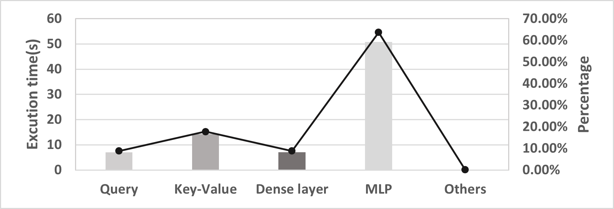
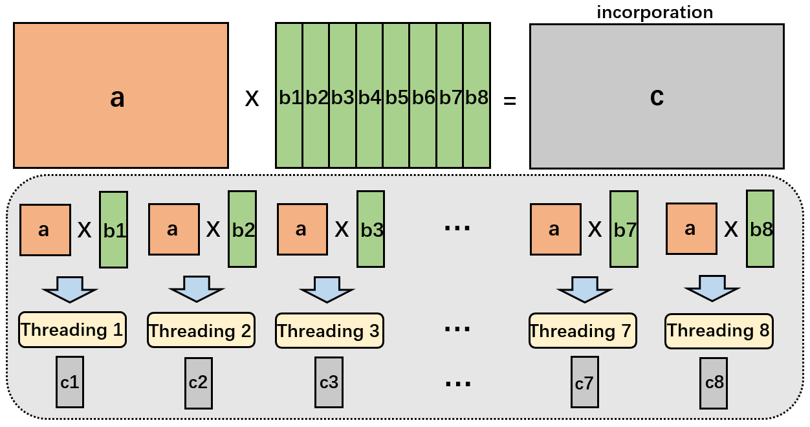
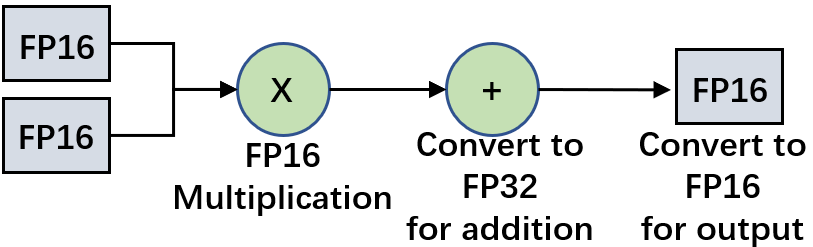
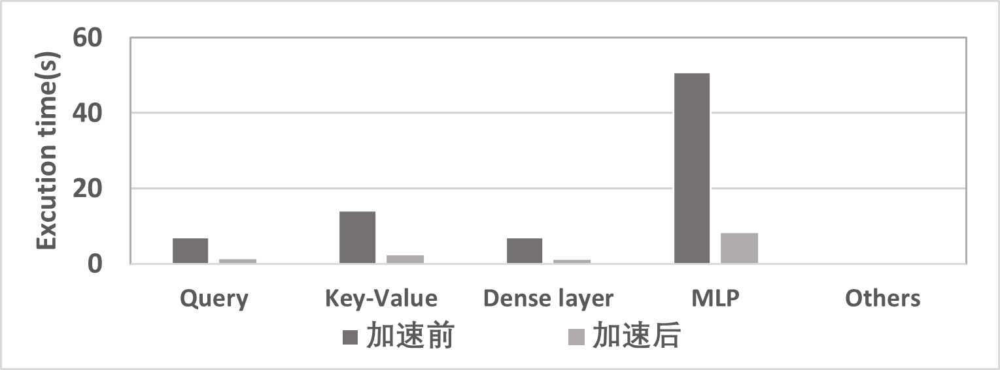
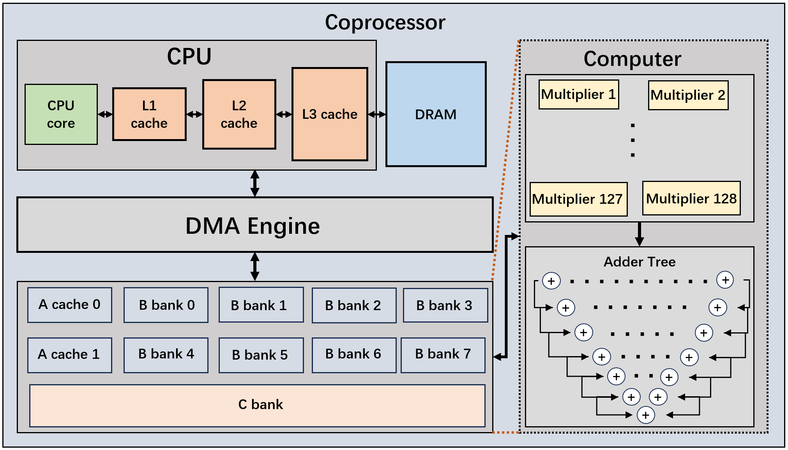
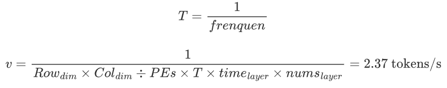

# MTVM and FlexCPA:RISC-V架构下的大模型推理加速算法和架构

# 目录
- [引言](## 引言)
- [1、如何使用](##1、如何使用)
- [2、模型推理时间分析](##2、模型推理时间分析)
- [3、MTVM算法](##3、MTVM算法)
- [4、加速结果](##4、加速结果)
- [5、GEM5验证结果](##5、GEM5验证结果)
- [6、协处理器设计](##6、协处理器设计)

## 引言

**在引入协处理器的情况下，本作品的推理速度可以达到 `2.37tokens/s` 。而未引入协处理器的情况下，在QEMU中的openEuler 2403系统中以8线程为例，在GEM5中验证出本作品以FP16为基准针对TeleChat-12B模型的加速达到了：0.176tokens/s。在虚拟机中相对于未进行加速的模型推理速度加速了7倍。**

**注：本项目为原创作品，代码原创程度90%以上。所有代码均已上传，其中矩阵计算部分代码在[torch_extension](https://atomgit.com/2ndrisc-v/000020-xiaobai/tree/master/torch_extension)中，GEM5验证部分代码在[GEM5](https://atomgit.com/2ndrisc-v/000020-xiaobai/tree/master/gem5)中。协处理器的Verilog代码在[Coprocessor](https://atomgit.com/2ndrisc-v/000020-xiaobai/blob/master/Coprocessor)**

**若在复现本作品中存在技术性疑问，欢迎致信xuewuzhijingzhs@163.com进行探讨**

## 1、如何使用

本作品复现使用方式有如下两种：**1、使用我们提供的操作系统镜像。2、根据本教程自行移植运行环境。**

### 1.1、下载运行环境搭建好的openEuler 2403操作系统镜像

我们团队已经将TeleChat-12B模型运行环境移植到RISC-V openEuler 2403操作系统，其中打包好的镜像已经上传，可见网盘连接[https://pan.baidu.com/s/1e7MwLC1F_wWkT9rorDALPA?pwd=xiao](https://pan.baidu.com/s/1e7MwLC1F_wWkT9rorDALPA?pwd=xiao) ，提取码：`xiao`。下载解压完成后，进入over2403文件，打开`start_vm_xfce.sh`文件，修改`vcpu`参数（最小为8），`vcpu`参数的大小以您使用的硬件条件来决定，比如64核电脑的，就可以设置为64，**这个参数将会决定你接下来进行模型推理时可以使用的多线程的数量**。随后执行如下代码：

```bash
bash ./start_vm_xfce.sh
```

其中，用户名称为`root`，默认密码为`123456`。
进入操作系统后，可进行模型推理，而询问的问题可在[inference.py](https://atomgit.com/2ndrisc-v/000020-xiaobai/blob/master/inference.py)文件中修改，如若想修改问题，可执行

```bash
vim inference.py
```
自行修改问题为自己想要推理的问题。随后执行推理代码

```bash
python3 ./inference.py
```
运行时，模型会自动检测当前支持的线程总数并自动分配，即会根据`start_vm_xfce.sh`文件中设置的`vcpu`参数。
**另外提示，本镜像需要QEMU版本为9.1.90（旧版本v扩展为0.7版本，不符合赛题要求）。**

### 1.2、自行配置openEuler 2403操作系统

首先，下载`QEMU-RISCV>=9.1.90`。搭建TeleChat-12B模型在RISC-V openEuler 2403系统运行环境部分重要的包如下，全部安装环境可见[requirements.txt](https://atomgit.com/2ndrisc-v/000020-xiaobai/blob/master/requirements.txt)文件。

`gcc==14.1.1`

`python==3.11.6`

`pytorch==v2.30.0`

`transformers`

`sentencepiece`

`accelerate>=0.26.0`

由于搭建运行环境所需要的各种软件包相当复杂，建议大家使用我们提供的镜像。
在安装好各种依赖之后，修改`/usr/local/lib/python3.11/site-packages/transformers/generation/utils.py`的1977行

```python
synced_gpus = (is_deepspeed_zero3_enabled() or is_fsdp_managed_module(self)) and dist.get_world_size() > 1
```

改为

```python
synced_gpus = is_deepspeed_zero3_enabled() and dist.get_world_size() > 1
```


去TeleChat模型仓库下载TeleChat模型

```bash
git lfs clone https://huggingface.co/Tele-AI/TeleChat-12B
```

将我们修改好的模型文件[modeling_telechat.py](https://atomgit.com/2ndrisc-v/000020-xiaobai/blob/master/modeling_telechat.py)下载到本地，并替换掉`TeleChat-12B/modeling_telechat.py`模型文件。启动openEuler 2403系统后，执行

```bash
scp -P 12055 TeliCaht-12B root@localhost:/root
```

至此，模型已经可以进行推理。**最重要的一步来了，进行算法替换。**

将编译好的库文件[llm_extension_cpp.so](https://atomgit.com/2ndrisc-v/000020-xiaobai/blob/master/llm_extension_cpp.so)（您也可进入[torch_extension](https://atomgit.com/2ndrisc-v/000020-xiaobai/tree/master/torch_extension)目录中自行编译）和[inference.py](https://atomgit.com/2ndrisc-v/000020-xiaobai/blob/master/inference.py)文件下载到本地之后，在本地执行

```bash
scp -P 12055 llm_extension_cpp.so root@localhost:/root
scp -P 12055 inference.py root@localhost:/root
```

然后在虚拟机上执行

```bash
cp llm_extension_cpp.so .cache/torch_extensions/py311_cpu/llm_extension_cpp/
```

输入`yes`替换掉原来的`llm_extension_cpp.so`文件。

确保`inference.py`文件为自己想要推理的问题后，在root目录下执行

```bash
python3 ./inference.py
```

推理中会根据当前系统物理核心数分配线程。

## 2、模型推理时间分析

在使用QEMU的虚拟机openEuler 2403系统对原始TeleChat-12B模型进行推理的过程中，我们对模型推理过程中各个算子的计算时间进行了统计并输出，任选一层为例，将输出结果放到下面。

```bash
input_layernorm time: 0.006394s
Step 1 (Transpose hidden_states) time: 0.000088 seconds
Step 2 (Query layer computation) time: 7.047749 seconds
Step 3 (Key-Value layer computation) time: 14.150128 seconds
Step 4 (Attention computation) time: 0.085835 seconds
Step 5 (Attention score computation) time: 0.023373 seconds
Step 6 (Dense layer) time: 7.041073 seconds
Step 7 (Residual connection and dropout) time: 0.003791 seconds
Final output preparation time: 0.000007 seconds
Total forward pass time: 28.354921 seconds
self_attention time: 28.355470s
post_attention_layernorm time: 0.006780s
Output =  tensor([[[-0.2751, -0.0576,  0.4800,  ...,  0.6382,  0.0764,  0.2983],
         [ 1.0498,  0.0129, -0.1569,  ..., -0.1103, -1.2100,  0.0688],
         [ 0.9351,  0.1174,  0.1030,  ..., -0.1514, -0.8589, -0.1729],
         [ 0.5195,  0.0273, -0.1425,  ..., -0.7197, -0.7148, -0.5747],
         [ 1.0791, -1.0732, -0.1055,  ..., -1.0430, -1.4619, -0.0845],
         [ 0.1089, -0.5571, -0.1565,  ..., -0.6084, -0.9888, -0.1620]]],
       dtype=torch.float16)
mlp time: 50.796742s
```

如图1所示，我们可以得出，QKV矩阵计算以及线性层MLP矩阵计算的时间占了推理总时间的绝大部分，非矩阵运算的过程几乎不占时间。因此我们将加速的目标放在了矩阵计算部分。
<p align="center">

</p>

<p align="center">
  图1
</p>

在传统的矩阵计算方法中，无论是乘法还是加法， 矩阵的计算都是针对整个矩阵进行计算，单个矩阵的计算依赖于单个线程的处理，而当矩阵的规模增大时，单个线程处理矩阵计算带来的时间消耗会成为无法逾越的性能瓶颈。因此，本作品将会解决第一个问题：如何在RISC-V架构下合理的将多线程引入矩阵计算。

与此同时，在pytorch使用的矩阵计算方法中，矩阵的计算是针对矩阵中每一个元素进行运算。这样的运算太过于繁琐，赛题提到的V扩展便也非常值得探讨。由于RISC-V架构的开源特性使得V扩展可以被广泛采用并灵活定制，为V扩展的引入提供了基础。因此，本作品将会解决第二个问题：如何在RISC-V架构下将V扩展合理的引入矩阵计算中。

## 3、MTVM算法

MTVM（Multi-Thread Vector Matrix）算法，为本作品加速的核心算法。

此算法替换了模型推理过程中pytorch的矩阵计算方法，通过引入多线程、V扩展来加速矩阵计算的速度，使得模型推理速度得到极大提升。

#### 3.1、多线程实现方法

随着大模型的发展，矩阵的规模也随之扩大，单线程的处理略显乏力。MTVM算法将一个大规模的矩阵用多个线程进行处理，采用的方法如图2所示，将两个大规模矩阵切割为数个小矩阵，再对应的分别放到不同的线程上进行矩阵计算，从而减小矩阵运算时间。
<p align="center">

</p>
<p align="center">
  图2
</p>

多线程切割矩阵算法的核心实现代码如下，完整的源码可见[/torch_extension/src/llm_extension.cpp](/torch_extension/src/llm_extension.cpp)。

```c++
torch::Tensor B_sliced = B.index({torch::indexing::Slice(), torch::indexing::Slice(start, end)});
torch::Tensor C_sliced = C.index({torch::indexing::Slice(), torch::indexing::Slice(start, end)});
```


#### 3.2、V扩展实现方法

而RISC-V架构下引入V扩展进行计算可参考openblas中的思想。**矩阵 A** 和 **矩阵 B** 由行向量和列向量构成。

```bash
A = [ A11 A12 A13 ]     B = [ B11 B12 ]
    [ A21 A22 A23 ]         [ B21 B22 ]
    [ A31 A32 A33 ]         [ B31 B32 ]
```

上述矩阵 A 被分解为 3 个行向量，矩阵 B 被分解为 2 个列向量。

```bash
A1 = [A11, A12, A13]     B1 = [B11, B21, B31]
A2 = [A21, A22, A23]     B2 = [B12, B22, B32]
```

然后，逐一计算行列向量的点积，得到矩阵 C。向量 A 的每一行与向量 B 的每一列并行计算。每个点积通过向量指令并行处理，从而加速运算。

```bash
A1 · B1 → C11
A1 · B2 → C12
A2 · B1 → C21    
A2 · B2 → C22
A3 · B1 → C31    
A3 · B2 → C32
```
在模型推理过程中，prefill阶段的计算为矩阵之间的计算，使用的算法为GEMM；而后续的generate阶段则变为了向量与矩阵之间的计算，使用的算法为GEMV。我们的V扩展即在GEMM算法中实现也在GEMV中计算，全方面覆盖了模型推理中矩阵计算的每一个算子。
### 3.3、支持全FP16精度（创新）与混合精度

我们在实验过程中发现`cuda`与`cpu`在进行FP16矩阵加法过程中，是先将FP16转为FP32再进行矩阵加法的计算，避免了精度的损失。
而本赛题要求以FP16为基准进行评测，cuda并不支持全程以FP16进行计算，而我们的算法支持全程以FP16进行计算，虽然降低结果的精度，无疑会提升模型推理速度。在这个基础之上，我们还设计了另一套与cuda相同的混合精度的计算算法，来应对不同的应用场景。具体的计算过程如图3所示，在矩阵乘仍然为FP16的情况下，矩阵加法改为FP32进行计算，并且兼容多线程核V扩展，进而提高了模型的精度。

<p align="center">

</p>

<p align="center">
图3
</p>

## 4、加速结果
使用了我们MTVM算法改良后的模型推理速度显著加快。在QEMU中用我们搭建好的openEuler 2403系统进行推理，我们记录了与之前同一层的输出结果：

```bash
input_layernorm time: 0.011893s
Step 1 (Transpose hidden_states) time: 0.000127 seconds
Step 2 (Query layer computation) time: 1.188071 seconds
Step 3 (Key-Value layer computation) time: 2.282324 seconds
torch.Size([6, 1, 32, 160])
torch.Size([6, 1, 32, 160])
(1, 32, 6, 6)
Step 4 (Attention computation) time: 0.108286 seconds
Step 5 (Attention score computation) time: 0.021329 seconds
Step 6 (Dense layer) time: 1.068047 seconds
Step 7 (Residual connection and dropout) time: 0.003800 seconds
Final output preparation time: 0.000008 seconds
Total forward pass time: 4.674949 seconds
self_attention time: 4.675324s
post_attention_layernorm time: 0.006649s

Output =  tensor([[[-0.2751, -0.0576,  0.4800,  ...,  0.6382,  0.0764,  0.2983],
         [ 1.0498,  0.0129, -0.1569,  ..., -0.1103, -1.2100,  0.0688],
         [ 0.9351,  0.1174,  0.1030,  ..., -0.1514, -0.8589, -0.1729],
         [ 0.5195,  0.0273, -0.1425,  ..., -0.7197, -0.7148, -0.5747],
         [ 1.0791, -1.0732, -0.1055,  ..., -1.0430, -1.4619, -0.0845],
         [ 0.1089, -0.5571, -0.1565,  ..., -0.6084, -0.9888, -0.1620]]],
       dtype=torch.float16)
mlp time: 8.097835s
```

对比未经过加速的推理速度，self_attention time从28.355470s降低到了4.675324s；而MLP time从50.796742s降低到了8.097835s；一层需要的总推理时间从79.158992s降低到了12.779808s，加速效果相当明显。
如图4所示，我们将涉及到矩阵乘的每一个算子都加速到了一个相当快的程度。
<p align="center">

</p>

<p align="center">
图4
</p>

## 5、GEM5验证结果

在GEM5上验证我们的结果时，GEM5中如何配置可见rvv_test.py。之后我们在GEM5上运行了 torch_extension_cpp_thread_gemm_without_time和torch_extension_cpp_thread_gemv_without_time，这两个可执行文件分别为GEMM计算和GEMV计算的验证文件，验证的输出结果为：

```bash
torch_extension_cpp_thread_gemm_without_time:0.277531

torch_extension_cpp_thread_gemv_without_time:0.013111
```

说明使用MTVM算法执行一次与模型推理同等规模的GEMM需要0.277531，而执行一次与模型推理同等规模GEMV需要0.013111。

在有了这些结果的基础之上，我们将GEM5中的验证速度替换到QEMU中虚拟机openEuler 2403系统进行模型推理速度，得出在模型推理出一个FP16的token需要**5.685879s**，即速度达到了**0.176tokens/s**。
## 6、协处理器设计

### 6.1、为什么需要引入协处理器

现代的深度学习模型，尤其是大型神经网络，包含大量的矩阵运算和并行计算任务。虽然CPU能够处理这些任务，但它的计算能力通常远不如GPU或FPGA等专用硬件。协处理器（如GPU、FPGA）能够同时处理数千个小的计算单元，这对于神经网络的并行运算非常重要，而CPU一般具有较少的核心（例如，4到16个核心），难以提供相同的并行处理能力。协处理器能够承担特定类型的计算（如矩阵运算、卷积操作等），从而减轻CPU的负担，使得CPU能够处理其他任务，如调度、数据加载、控制流等，达到更高的系统效率。协处理器和CPU协同工作，分别处理不同的任务，可以充分利用异构计算的优势，提高系统的整体性能。

而FPGA的核心优势在于其可编程性，可以根据特定的应用需求定制硬件架构。与GPU等固定功能的加速器不同，FPGA可以为特定的计算任务（如矩阵乘法、卷积运算、Softmax计算等）设计高效的专用硬件电路，极大地提高计算效率。FPGA支持高度的并行处理，可以根据需求并行执行多个计算任务，从而加速深度学习模型中的某些关键步骤。FPGA能够将计算和存储资源放在同一个硬件平台上，减少了数据从CPU到协处理器的传输延迟，进一步降低了整体的推理延迟。FPGA可以与CPU等处理器协同工作，在需要时可以将复杂的计算任务交给FPGA处理，而CPU则负责控制、调度和其他辅助任务。这样可以实现软硬件协同优化，提高系统的整体性能。

### 6.2、协处理器设计

结合上述，本设计将使用FPGA作为协处理器来进行加速。具体设计图如图5所示。我们引入了一个DMA Engine作为内存控制单元。在协处理器芯片上有2块存储矩阵A的bank，每一个bank可存储128个16位的浮点数。8块存储矩阵B的bank，每一块可存储128×128个16位浮点数。只有一块存储结果C的bank，可存储B矩阵的列数个16位浮点数。为了节省数据传输时间，我们两块A bank用俩交替使用，当A bank 1在进行计算时，A bank 2缓存下一次矩阵乘法需要的A矩阵中的数据，而当A bank 2进行计算时A bank 1则提前存储下一次计算需要的A矩阵中的数据。B bank存储B矩阵分块后的数据，无需大量的数据移动。C存储矩阵乘的结果，向量乘矩阵时，C bank一直累加直到计算完成输出。当矩阵乘矩阵时，A矩阵每一行的数据计算完成后输出C bank的数据，相当于完成了一次向量乘矩阵的计算，随后将C bank置零后继续进行下一行的计算。
<p align="center">

</p>

<p align="center">
图5
</p>
在图5中我们可以看到，协处理器的计算单元拥有128个并行的乘法器以及一个宽度为64的加法器组，进而一个周期可以计算128个A矩阵的数据与128个B矩阵的数据相乘。并且协处理器的各个计算器件全部为流水线设计，在一开始有7个周期的延迟后便再无延迟。

### 6.3、协处理器功耗

我们撰写了协处理器芯片的代码并且在Vivado上进行了综合布线，协处理器的功率和频率如以下两个表格：

| FPGA板   | xcvu37p-fsvh2892-3-e |
| -------- | -------------------- |
| **功率** | **4.877W**           |
| **频率** | **200Mhz**           |
| **周期** | **5ns**           |

| **资源** | **消耗** | **占比** |
| -------- | -------- | -------- |
| **LUF**      | 1294540  | 9.93%    |
| **FF**       | 278655   | 10.69%   |
| **DSP**      | 128      | 1.42%    |
| **IO**       | 12       | 1.92%    |

### 6.4、推理速度计算

在引入了协处理器以后，矩阵计算部分则不用CPU进行处理，因此我们的推理会快许多。在维度为5120×5120的的情况时，推理速度为:
<p align="center">

</p>

